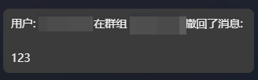

# astrbot\_plugin\_anti\_recall

**[仅限 aiocqhttp] 防撤回插件**

## 简介

`astrbot_plugin_anti_recall` 是一个专为 `aiocqhttp` 平台设计的防撤回插件。通过开启监控指定会话，该插件可以将会话内被撤回的消息转发给指定的接收者。

## 功能

- **消息监控**：实时监控指定群组的消息撤回事件。
- **消息转发**：将撤回的消息转发给指定的用户。
- **任务管理**：支持添加、删除和查看防撤回任务。
- **自动清理**：定期清理临时文件，确保插件运行高效。

## 已知问题

1. 目前仅支持群聊防撤回，不支持私聊。
2. 因Astrbot框架本身的限制，收到的转发消息可能会存在换行缺失的问题，期待后续Astrbot修复。

## 更新日志

### 2025-10-27 合并转发支持更新

**新增功能**：
- 增加对合并转发消息的支持，现在可以监控并记录合并转发消息

**优化改进**：
- 增加待处理撤回队列，防止消息乱序问题
- 增加框架内存缓存，减少快速撤回消息丢失概率
- 统一文件操作方案，提高代码稳定性
- 避免保存config时重复变更数据类型
- 改用asyncio延迟删除临时文件，提升性能
- 采用StarTools.get_data_dir()方法获取临时目录

### 2025-10-21 优化更新

**问题修复**：
- 修复了消息撤回过快导致记录丢失的问题
- 修复了消息和撤回通知乱序到达导致的记录丢失问题

**优化改进**：
1. **双重缓存机制**：新增内存缓存（LRU算法），最多缓存1000条消息，保存30分钟
2. **延长文件保存时间**：将消息文件保存时间从5分钟延长至30分钟
3. **智能文件查找**：优化文件查找算法，支持按时间范围和通配符双重匹配
4. **增强错误处理**：增加了详细的调试日志，便于排查问题
5. **性能优化**：内存缓存优先，减少文件IO操作
6. **待处理撤回队列**：新增待处理撤回通知机制，处理消息乱序到达问题

**技术细节**：
- 使用`OrderedDict`实现LRU缓存，确保内存使用可控
- 消息同时保存在内存缓存和文件中，提供双重保障
- 缓存过期时间统一为30分钟，平衡性能与资源占用
- 新增缓存命中率日志，方便监控插件运行状态
- 待处理撤回队列最多保存100个撤回通知，1分钟后自动过期

| 期望输出                       | 实际输出                           |
|----------------------------|--------------------------------|
|  |  |
